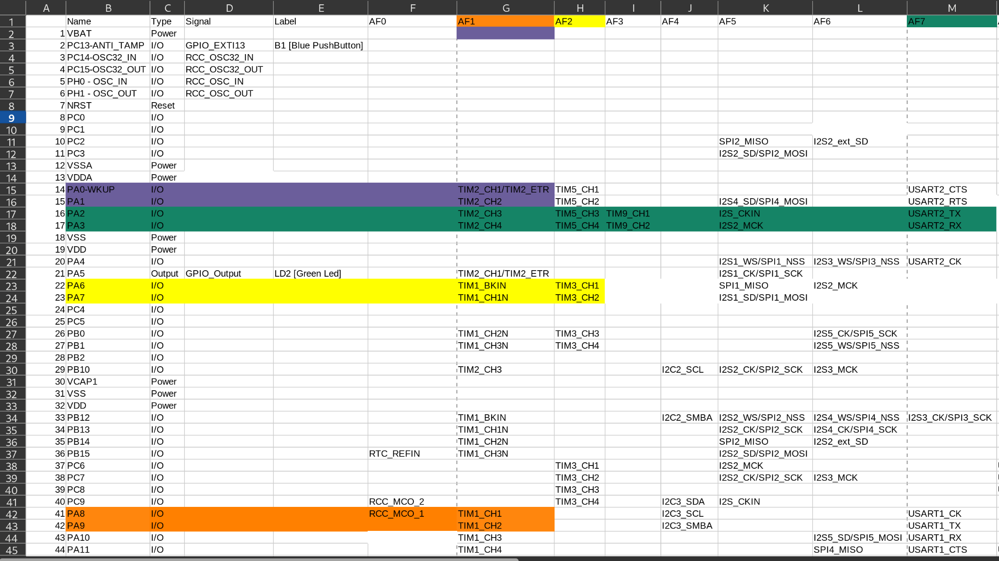
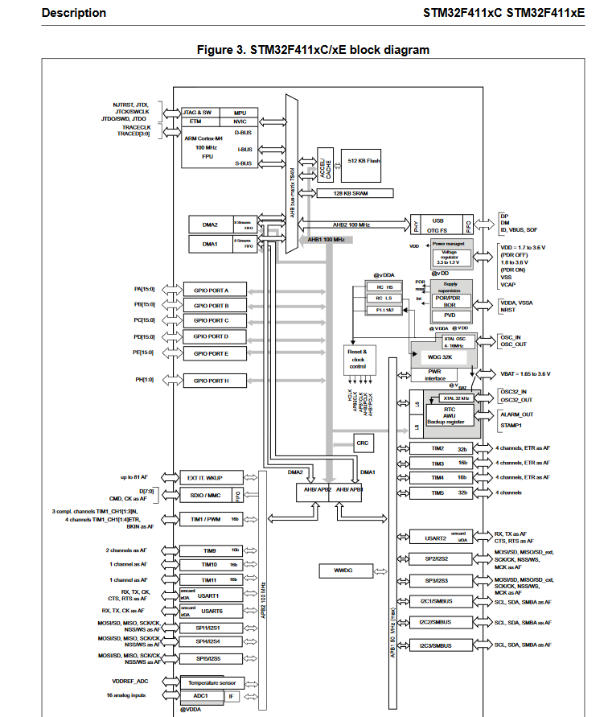
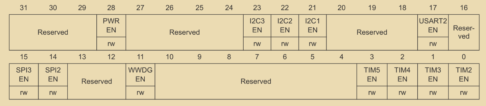

# Pinout

For choosing which peripherals to use for what inspect the [reference manual](../docs/NUCLEOF411RE_reference_manual.pdf). It is also important that the chosen peripherals use different pins for their alternate functions. In that way the following choices were made:
 - TIM2 - PWM mode
 - TIM1 and TIM3 - Encoder (Quadrature) mode
 - USART2 (because TIM1 is already using the TX pin of USART1)
 - TIM10 - PID timer
 - TIM11 - UART read buffer timer

The easiest way to find out which pins we need is to export the pinout of the MCU from STM32CubeIDE:
 1. File -> New -> STM32 Project
 2. In the Commercial Part Number field type NUCLEO-F411RE and choose the only suggestion that shows up in the table
 3. Click through the rest of the setup to generate a project which has built-in information about the board we are using
You can now export the pinout with alternate functions from the IOC menu by clicking the Pinout drop down above the MCU.

From this we can concur which pins need to be in which alternate functions to enable the mode we need:
 - TIM1 CH1 and CH2 - PA8 and PA9 in AF1
 - TIM2 CH1 and CH2 - PA0 and PA1 in AF1 
 - TIM3 CH1 and CH2 - PA6 and PA7 in AF2
 - USART2_TX and USART2_RX - PA2 and PA3 in AF7

Since now we know which pins are in use and for what the shield schematic is straightforward in connecting them to the appropriate driver inputs and outputs so we can communicate with the motors and their integrated encoders.
The software part only needs to tell the microcontroller on which port they are and in what alternate function.

Depending on what bus the peripheral or pin used is, its appropriate clock source needs to be enabled also:

For example, since USART2 is connected to the bus APB1 its clock source is enabled through the RCC register APB1ENR by writing a 1 to the USART2EN bit:

# Main

STM32CubeIDE allows the user to configure all needed peripherals through a graphical `.ioc` menu. In that case all of 
the autogenerated HAL (Hardware Abstraction Layer) code shows up in `main.c`. HAL is very handy in speeding up the 
process of configuration, but it makes the code very hard to understand which is why I opted to use the raw register approach.

As a consequence, the code is organised in multiple files with `main.c` containing only the initialization function calls for each module 
and the autogenerated system clock setup.

Function calls used in `main.c`:
- `void USART2_Init()` - Initializes USART2 peripheral over pins PA2 and PA3 with interrupt handler  
- `void UART_Interrupt_Init()` - Configures timer peripheral TIM10 with 1ms interrupt which checks input buffer  
- `void PID_Odom_Interrupt_Init()` - Configures timer peripheral TIM11 with 10ms interrupt which executes PID computation and updates odometry data  
- `void Motors_Init()` - Configures timer peripheral TIM2 channels 1 and 2 as PWM output and driver direction pins  
- `void Encoders_Init()` - Configures timer peripherals TIM1 and TIM3 in Encoder Quadrature mode   

# Odometry

# UART communication

# Motor control
